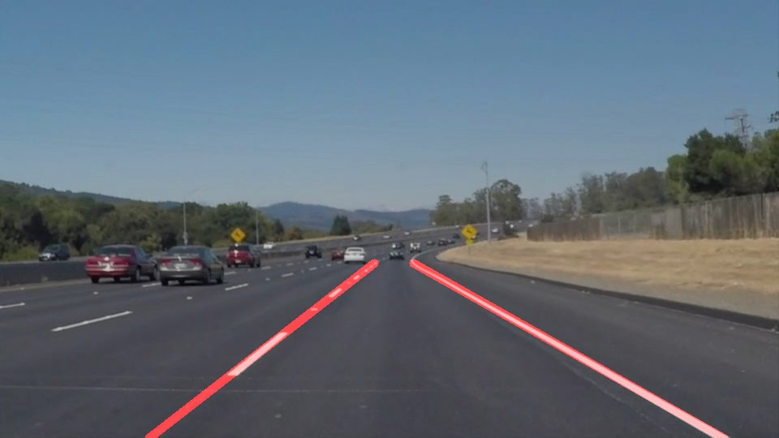

# **Finding Lane Lines on the Road** 
[](http://www.udacity.com/drive)


Overview
---

When we drive, we use our eyes to decide where to go.  The lines on the road that show us where the lanes are act as our constant reference for where to steer the vehicle.  Naturally, one of the first things we would like to do in developing a self-driving car is to automatically detect lane lines using an algorithm.

In this project you will detect lane lines in images using Python and OpenCV.  OpenCV means "Open-Source Computer Vision", which is a package that has many useful tools for analyzing images.  

To complete the project, two files will be submitted: a file containing project code and a file containing a brief write up explaining your solution. We have included template files to be used both for the [code](https://github.com/udacity/CarND-LaneLines-P1/blob/master/P1.ipynb) and the [writeup](https://github.com/udacity/CarND-LaneLines-P1/blob/master/writeup_template.md).The code file is called P1.ipynb and the writeup template is writeup_template.md 

To meet specifications in the project, take a look at the requirements in the [project rubric](https://review.udacity.com/#!/rubrics/322/view)


Creating a Great Writeup
---
For this project, a great writeup should provide a detailed response to the "Reflection" section of the [project rubric](https://review.udacity.com/#!/rubrics/322/view). There are three parts to the reflection:


### Reflection

### 1. Describe your pipeline. As part of the description, explain how you modified the draw_lines() function.

My pipeline consisted of 5 steps. First, I converted the images to grayscale then apply Gaussian Smoothinig Filter to suppressing noise and spurious gradients bu averaging. After that, I use Canny edge detector on this image and select the region where we expect to find the lane lines. Finally, I use the HoughLinesP function to find lane lines and draw the lines in the image.
```python
def image_draw_lines(img):
    gray = grayscale(img)

    kernel_size = 5
    blur_gray = gaussian_blur(gray, kernel_size)

    low_threshold = 50
    high_threshold = 150
    edges = canny(blur_gray, low_threshold, high_threshold)

    imshape = img.shape
    vertices = np.array([[(0, imshape[0]), (470, 320),
                          (520, 320), (imshape[1], imshape[0])]], dtype=np.int32)
    masked_edges = region_of_interest(edges, vertices)

    rho = 2
    theta = np.pi / 180
    threshold = 15
    min_line_length = 40
    max_line_gap = 20
    line_img = hough_lines(masked_edges, rho, theta, threshold,
                           min_line_length, max_line_gap)
    lines_edges = weighted_img(line_img, img)

    return lines_edges
```

In order to draw a single line on the left and right lanes, I modified the draw_lines() function by ...
Firestly, I separat the line segments into two group, left and right, by their slope.
``` python
left_points = []
right_points = []
for line in lines:
    for x1, y1, x2, y2 in line:
        slope = (y2 - y1) / (x2 - x1)
        if (slope < -0.5) & (slope > -0.9):
            left_points.append([x1, y1])
            left_points.append([x2, y2])
        elif (slope > 0.4) & (slope < 0.8):
            right_points.append([x1, y1])
            right_points.append([x2, y2])
```
Than I use the method of Least squares polynomial fit to find the lane lines and draw the lines in the image.
```python
def extrapolate(points, imshape):
    fit = np.polyfit(points[:, 0], points[:, 1], 1)
    top_y = int(imshape[0] * 0.6)
    top_x = int((top_y - fit[1]) / fit[0])
    bottom_y = imshape[0]
    bottom_x = int((bottom_y - fit[1]) / fit[0])

    return top_x, top_y, bottom_x, bottom_y
```

```python
left_points = np.array(left_points)
x1, y1, x2, y2 = extrapolate(left_points, img.shape)
cv2.line(img, (x1, y1), (x2, y2), color, thickness)

right_points = np.array(right_points)
x1, y1, x2, y2 = extrapolate(right_points, img.shape)
cv2.line(img, (x1, y1), (x2, y2), color, thickness)
```

If you'd like to include images to show how the pipeline works, here is how to include an image: 

 


### 2. Identify potential shortcomings with your current pipeline


One potential shortcoming would be the shake of the detected lane lines.

Another shortcoming could be the complex of scenes of lane line detection. When the lane line is a curve, straight lines do not apply to this scenario.

### 3. Suggest possible improvements to your pipeline

A possible improvement would use several images to detect the lane lines, not just current one.

Another potential improvement could be to use some kind of higher order polynomial fit to handle curvy lanes.


We encourage using images in your writeup to demonstrate how your pipeline works.  

All that said, please be concise!  We're not looking for you to write a book here: just a brief description.

You're not required to use markdown for your writeup.  If you use another method please just submit a pdf of your writeup. Here is a link to a [writeup template file](https://github.com/udacity/CarND-LaneLines-P1/blob/master/writeup_template.md). 


The Project
---

## If you have already installed the [CarND Term1 Starter Kit](https://github.com/udacity/CarND-Term1-Starter-Kit/blob/master/README.md) you should be good to go!   If not, you should install the starter kit to get started on this project. ##

**Step 1:** Set up the [CarND Term1 Starter Kit](https://github.com/udacity/CarND-Term1-Starter-Kit/blob/master/README.md) if you haven't already.

**Step 2:** Open the code in a Jupyter Notebook

You will complete the project code in a Jupyter notebook.  If you are unfamiliar with Jupyter Notebooks, check out [Udacity's free course on Anaconda and Jupyter Notebooks](https://classroom.udacity.com/courses/ud1111) to get started.

Jupyter is an Ipython notebook where you can run blocks of code and see results interactively.  All the code for this project is contained in a Jupyter notebook. To start Jupyter in your browser, use terminal to navigate to your project directory and then run the following command at the terminal prompt (be sure you've activated your Python 3 carnd-term1 environment as described in the [CarND Term1 Starter Kit](https://github.com/udacity/CarND-Term1-Starter-Kit/blob/master/README.md) installation instructions!):

`> jupyter notebook`

A browser window will appear showing the contents of the current directory.  Click on the file called "P1.ipynb".  Another browser window will appear displaying the notebook.  Follow the instructions in the notebook to complete the project.  

**Step 3:** Complete the project and submit both the Ipython notebook and the project writeup

## How to write a README
A well written README file can enhance your project and portfolio.  Develop your abilities to create professional README files by completing [this free course](https://www.udacity.com/course/writing-readmes--ud777).

