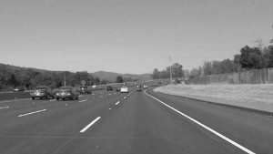

# **Finding Lane Lines on the Road** 

## Writeup Template

### You can use this file as a template for your writeup if you want to submit it as a markdown file. But feel free to use some other method and submit a pdf if you prefer.

---

**Finding Lane Lines on the Road**

The goals / steps of this project are the following:
* Make a pipeline that finds lane lines on the road
* Reflect on your work in a written report


[//]: # (Image References)

 

---

### Reflection

### 1. Describe your pipeline. As part of the description, explain how you modified the draw_lines() function.

My pipeline consisted of 5 steps. First, I converted the images to grayscale then apply Gaussian Smoothinig Filter to suppressing noise and spurious gradients bu averaging. After that, I use Canny edge detector on this image and select the region where we expect to find the lane lines. Finally, I use the HoughLinesP function to find lane lines and draw the lines in the image.
```python
def image_draw_lines(img):
    gray = grayscale(img)

    kernel_size = 5
    blur_gray = gaussian_blur(gray, kernel_size)

    low_threshold = 50
    high_threshold = 150
    edges = canny(blur_gray, low_threshold, high_threshold)

    imshape = img.shape
    vertices = np.array([[(0, imshape[0]), (470, 320),
                          (520, 320), (imshape[1], imshape[0])]], dtype=np.int32)
    masked_edges = region_of_interest(edges, vertices)

    rho = 2
    theta = np.pi / 180
    threshold = 15
    min_line_length = 40
    max_line_gap = 20
    line_img = hough_lines(masked_edges, rho, theta, threshold,
                           min_line_length, max_line_gap)
    lines_edges = weighted_img(line_img, img)

    return lines_edges
```

In order to draw a single line on the left and right lanes, I modified the draw_lines() function by ...
Firestly, I separat the line segments into two group, left and right, by their slope.
``` python
left_points = []
right_points = []
for line in lines:
    for x1, y1, x2, y2 in line:
        slope = (y2 - y1) / (x2 - x1)
        if (slope < -0.5) & (slope > -0.9):
            left_points.append([x1, y1])
            left_points.append([x2, y2])
        elif (slope > 0.4) & (slope < 0.8):
            right_points.append([x1, y1])
            right_points.append([x2, y2])
```
Than I use the method of Least squares polynomial fit to find the lane lines and draw the lines in the image.
```python
def extrapolate(points, imshape):
    fit = np.polyfit(points[:, 0], points[:, 1], 1)
    top_y = int(imshape[0] * 0.6)
    top_x = int((top_y - fit[1]) / fit[0])
    bottom_y = imshape[0]
    bottom_x = int((bottom_y - fit[1]) / fit[0])

    return top_x, top_y, bottom_x, bottom_y
```

```python
left_points = np.array(left_points)
x1, y1, x2, y2 = extrapolate(left_points, img.shape)
cv2.line(img, (x1, y1), (x2, y2), color, thickness)

right_points = np.array(right_points)
x1, y1, x2, y2 = extrapolate(right_points, img.shape)
cv2.line(img, (x1, y1), (x2, y2), color, thickness)
```

If you'd like to include images to show how the pipeline works, here is how to include an image: 

 


### 2. Identify potential shortcomings with your current pipeline


One potential shortcoming would be the shake of the detected lane lines.

Another shortcoming could be the complex of scenes of lane line detection. When the lane line is a curve, straight lines do not apply to this scenario.

### 3. Suggest possible improvements to your pipeline

A possible improvement would use several images to detect the lane lines, not just current one.

Another potential improvement could be to use some kind of higher order polynomial fit to handle curvy lanes.
